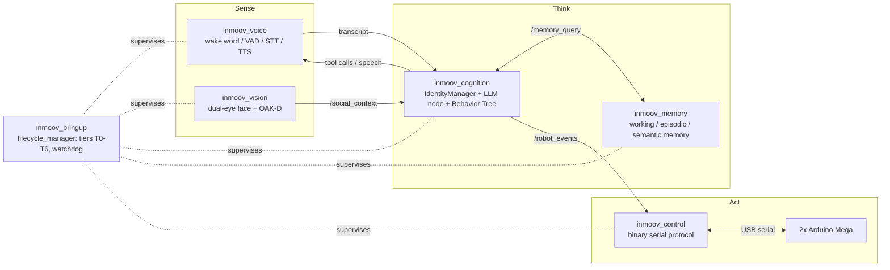

# InMoov ROS2

A ROS2 Jazzy stack driving a physical [InMoov](https://inmoov.fr/) humanoid
robot: dual-eye computer vision, a full voice pipeline (wake word, VAD, STT,
TTS), an LLM-driven cognition layer with tool calling and a three-layer
memory system, and a custom binary serial protocol to two Arduino Mega boards
for motion control. Everything is orchestrated by a tier-based lifecycle
manager built on ROS2 managed lifecycle nodes.

This is a hobby project built and tuned against one specific physical robot
— expect hardcoded defaults. Not as configuration
that works out of the box.

## Architecture



Data flows from perception (`inmoov_vision`, `inmoov_voice`) into a social/
dialogue context that `inmoov_cognition`'s Behavior Tree consumes as the
single source of truth (the Blackboard); the LLM node produces both spoken
text and tool calls (physical actions, memory ops, smart-home control); tool
calls become `/robot_events` that the Behavior Tree turns into motion
commands for `inmoov_control`. `inmoov_bringup` starts and supervises every
node in dependency-ordered tiers and exposes overall health on
`/lifecycle/status`.

## Packages

| Package | Purpose |
|---|---|
| [`inmoov_bringup`](src/inmoov_bringup/README.md) | Tier-based lifecycle orchestrator (T0-T6), watchdog, cascade activate/deactivate |
| [`inmoov_cognition`](src/inmoov_cognition/README.md) | Behavior Tree, social context (IdentityManager), LLM dialogue + tool calling, openHAB/Telegram bridges |
| [`inmoov_control`](src/inmoov_control/README.md) | Binary batch serial protocol to the left/right Arduino Mega boards, aggregated `/joint_states` |
| [`inmoov_memory`](src/inmoov_memory/README.md) | Three-layer memory: working (RAM), episodic (SQLite), semantic (ChromaDB) |
| [`inmoov_msgs`](src/inmoov_msgs/README.md) | Shared message/service/action definitions (`SoundDirection`, `MemoryQuery`, `Speak`) |
| [`inmoov_vision`](src/inmoov_vision/README.md) | Dual-eye face detection/tracking/recognition, emotion, OAK-D body perception, head tracking |
| [`inmoov_voice`](src/inmoov_voice/README.md) | Wake word, VAD, STT, sound localization (TDOA), voice emotion, streaming TTS |
| [`inmoov_description`](src/inmoov_description/README.md) | URDF/meshes for RViz2 reference — visual/kinematic comparison only, not used for control |

Each package's own README has the full node-by-node breakdown: every ROS2
parameter with its default and meaning, every topic/service/action with its
message type, external service dependencies, and known issues found while
documenting the code (races, unwired parameters, stale defaults — read
those sections before relying on a given node).

## Hardware

- **Onboard compute**: Geekom Mini PC A8 Max Ryzen 9 8945HS 32GB RAM running the
  full ROS2 graph.
- **LLM/TTS compute**: a separate machine with two GPUs 3090 and 5060, one serving the LLM
  (OpenAI-compatible API) and one serving TTS, both reached over the LAN —
  see `inmoov_cognition`/`inmoov_voice` READMEs for the exact endpoints
  (override their host/port parameters for your own setup).
- **Motion**: two Arduino Mega 2560 boards (left/right body halves), see
  [`Arduino/`](Arduino/) and `inmoov_control`.
- **Vision**: one USB camera per eye plus an OAK-D Lite depth camera in the
  torso.
- **Audio**: USB Jabra Speak 2 as the primary audio device.

## Build

Standard `colcon` workspace. System / ROS dependencies come from each
package's `package.xml` (rosdep); Python packages without a rosdep key are
listed in the packages' `requirements.txt`:

```bash
cd ~/ros2_ws
rosdep install --from-paths src --ignore-src -y \
    --skip-keys "python3-onnxruntime-pip python3-insightface-pip"
export PIP_IGNORE_INSTALLED=1     # pip packages go on top of Debian's (numpy 2 over 1.x, …)
pip install "numpy>=2.0" scipy
pip install --index-url https://download.pytorch.org/whl/cpu torch
pip install -r src/inmoov_voice/requirements.txt \
            -r src/inmoov_vision/requirements.txt \
            -r src/inmoov_cognition/requirements.txt \
            -r src/inmoov_memory/requirements.txt
colcon build
source install/setup.bash
```

[`tools/ci_install.sh`](tools/ci_install.sh) is the same sequence, verified in a clean
`ros:jazzy` container (it's what CI runs).

Tests (no hardware needed, after building and sourcing): `tools/run_tests.sh`
— runs every package's unit tests (skips the ament style linters and the
scripts that need a real Arduino); see each package's README for what they cover.

Bring up the whole robot (see `inmoov_bringup/README.md` for tier details
and launch arguments):

```bash
ros2 launch inmoov_bringup inmoov.launch.py
```

On the robot the stack runs as a systemd user service — unit, start scripts and
install steps are in [`tools/systemd/`](tools/systemd/README.md).

This is the only launch file of the stack (all nodes are lifecycle nodes
driven by `lifecycle_manager`); `vision:=false` / `telegram:=true` toggle the
optional parts. Single nodes can be run with `ros2 run` and transitioned with
`ros2 lifecycle set` — see each package's README.

## Health

The hardware nodes publish `/diagnostics` once a second — eye cameras (fps,
frame age, mirroring the other eye), OAK-D pipeline (detection packets/s),
microphone (chunk age, hardware Mute), Arduino links (connected, firmware
failsafe, rejected servo commands):

```bash
ros2 topic echo /diagnostics     # or: ros2 run rqt_robot_monitor rqt_robot_monitor
```

Lifecycle state of every node is on `/lifecycle/status` (see `inmoov_bringup`).

## Arduino firmware

[`Arduino/InMoovLeft/`](Arduino/InMoovLeft/) and
[`Arduino/InMoovRight/`](Arduino/InMoovRight/) hold the sketches for the two
Mega boards — binary frame protocol (see the `.ino` header comments and
`inmoov_control/README.md`'s Protocol section for the frame format and
servo/channel mapping). Flash with the Arduino IDE or `arduino-cli`.

## License

[GNU General Public License v3.0](LICENSE) throughout, including
`inmoov_description`'s URDF/launch files (adapted from
[Sentience-Robotics/inmoov_urdf](https://github.com/Sentience-Robotics/inmoov_urdf),
also GPL-3.0 — see that package's README for details).

## Author

Artur Fedjukevits, with assistance from Claude Code (Anthropic).
