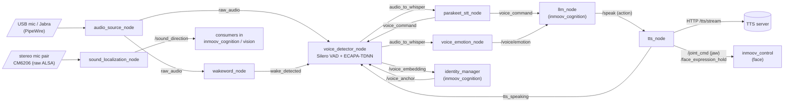

# inmoov_voice

Voice pipeline for the InMoov humanoid robot: microphone capture, wake-word
detection, voice activity detection with speaker verification, speech-to-text,
streaming text-to-speech with jaw/face synchronisation, sound-source
localization and voice-emotion recognition.

The **LLM** stage of the dialogue loop is *not* in this package — it lives in
[`inmoov_cognition`](../inmoov_cognition) (`llm_node`), which listens on
`voice_command` and sends replies to this package's `/speak` action.

All nodes are ROS2 **managed-lifecycle nodes** (`rclpy.lifecycle.LifecycleNode`)
and stay in `Unconfigured` until something drives them through
`configure` → `activate`. In the full robot this is done by
`lifecycle_manager` in [`inmoov_bringup`](../inmoov_bringup/README.md) (see
[Launch](#launch)).

Everything here is Python (`ament_python`). Runtime strings that are matched
against or spoken in Russian (the wake phrase "Эй Лёня", TTS text, the STT
language) are intentionally Russian.

## Pipeline overview



Dialogue cycle:

1. `audio_source_node` is the only node that opens the microphone; it
   publishes 32 ms float32 chunks on `raw_audio`.
2. `wakeword_node` runs a custom openWakeWord model on `raw_audio` and
   publishes `wake_detected`.
3. `voice_detector_node` keeps a rolling pre-roll buffer; on `wake_detected`
   (or automatically after the robot finishes speaking while a person is
   present) it records a phrase with Silero VAD, optionally filtering out
   foreign voices with ECAPA-TDNN speaker verification, and publishes the
   finished phrase on `audio_to_whisper`.
4. `parakeet_stt_node` transcribes the phrase and publishes the text on
   `voice_command`. `voice_emotion_node` classifies the same segment.
5. `llm_node` (other package) answers through the `/speak` action;
   `tts_node` streams audio from an HTTP TTS server, plays it, drives the jaw
   from the audio level and holds a face expression for the phrase, and
   publishes `tts_speaking` so the VAD ignores the robot's own voice.
6. `sound_localization_node` works alongside, on a separate stereo microphone
   pair, and publishes a coarse left/right bearing of the sound source.

Note: the topic name `audio_to_whisper` is a leftover from the
whisper.cpp era; the STT is now Parakeet.

## Nodes

Executables registered in [`setup.py`](setup.py):

| Executable | Module | Node name |
|---|---|---|
| `audio_source_node` | `inmoov_voice.audio_source_node:main` | `audio_source_node` |
| `wakeword_node` | `inmoov_voice.openwakeword_node:main` | `wakeword_node` |
| `voice_detector_node` | `inmoov_voice.voice_detector_node:main` | `voice_detector_node` |
| `parakeet_stt_node` | `inmoov_voice.parakeet_stt_node:main` | `parakeet_stt_node` |
| `tts_node` | `inmoov_voice.tts_node:main` | `tts_node` |
| `voice_emotion_node` | `inmoov_voice.voice_emotion_node:main` | `voice_emotion_node` |
| `sound_localization_node` | `inmoov_voice.sound_localization_node:main` | `sound_localization_node` |
| `diagnose` | `inmoov_voice.diagnose:main` | (not a node, see [below](#diagnose)) |

Topic names below are written as in the code; names without a leading `/`
are relative to the node namespace (empty in the default launch, so they
resolve to `/raw_audio`, etc.).

### `audio_source_node`

Source: [`inmoov_voice/audio_source_node.py`](inmoov_voice/audio_source_node.py).

The only node that opens the microphone (PyAudio, mono, int16). A reader
thread pushes chunks into a small queue (max 5); a timer running at 0.9 x the
chunk period drains the queue and publishes float32 samples in [-1, 1]. Also
contains an extensive PipeWire/WirePlumber self-healing layer written for a
Jabra Speak2 40 conference speaker (see [Known issues](#known-issues--todos)).

Lifecycle: `on_configure` declares parameters and creates the publisher;
`on_activate` opens the stream and returns `FAILURE` if it cannot (so the
lifecycle manager retries); `on_deactivate` closes the stream.

**Parameters**

| Name | Type | Default | Meaning |
|---|---|---|---|
| `sample_rate` | int | `16000` | Capture rate, Hz. |
| `chunk_size` | int | `512` | Samples per chunk (32 ms @ 16 kHz; matches Silero VAD / openWakeWord). |
| `device_index` | int | `-1` | PyAudio device index; `-1` = system default. |
| `device_name` | string | `''` | If set, overrides `device_index`: first device whose name contains this substring (case-insensitive); falls back to the system default if not found. |
| `watchdog_sec` | double | `5.0` | Watchdog period; restart the stream if no chunk was published for this long. |
| `pa_source_check` | string | `''` | If set, the stream is only opened when the PulseAudio default source (`pactl get-default-source`) contains this substring. Empty = no check. |
| `jabra_card_name` | string | `'Jabra_Speak2'` | Substring identifying the card in `pactl list cards`; empty disables the PipeWire recovery logic. |
| `jabra_profile` | string | `'output:analog-stereo+input:mono-fallback'` | Card profile that is expected/restored after a WirePlumber restart. |
| `zero_wp_check_count` | int | `500` | Consecutive all-zero chunks (~15 s) before PipeWire is inspected. |
| `wp_restart_cooldown_sec` | double | `90.0` | Minimum time between WirePlumber restarts. |
| `pw_full_restart_cooldown_sec` | double | `180.0` | Minimum time between full audio-stack restarts. |

**Topics**

| Topic | Type | Direction | Notes |
|---|---|---|---|
| `raw_audio` | `std_msgs/Float32MultiArray` | publish (lifecycle, depth 20) | `layout.dim[0]`: `label='sample_rate'`, `size=len(chunk)`, `stride=<sample rate>`. |

**Behavior**

- All-zero chunks are still published, but after ~3 s (100 chunks) a warning
  suggests checking the hardware Mute button on the Jabra (repeated every
  300 chunks); after `zero_wp_check_count` zero chunks a thread checks
  PipeWire (card present, profile correct, default source matches) and
  restarts WirePlumber if something is wrong.
- Watchdog: no stream, or no audio for `watchdog_sec`, restarts the stream.
  A closed stream is retried with exponential backoff (5 s doubling up to 120 s).
- WirePlumber restart (`systemctl --user restart wireplumber`), then waits up
  to 10 s for the source, restores the card profile (`pactl set-card-profile`),
  sets the Jabra `PCM` mixer control to 100 % (`aplay -l` + `amixer`) and
  restarts the stream. If 2 consecutive WirePlumber restarts fail to bring the
  source back, it escalates to restarting `pipewire`, `pipewire-pulse` and
  `wireplumber`.
- If 5 stream restarts happen within 30 s the node assumes a reader thread is
  stuck in PortAudio's C-level busy-retry loop, logs `fatal` and calls
  `os._exit(1)`; the bringup launch file's `respawn=True` then brings up a clean
  process.

### `wakeword_node`

Source: [`inmoov_voice/openwakeword_node.py`](inmoov_voice/openwakeword_node.py).

Wake-word detection ("Эй Лёня") with a **custom** openWakeWord model (ONNX
inference). Each `raw_audio` chunk is converted to int16 and fed to the model;
the first model key returned is used as the score.

**Parameters**

| Name | Type | Default | Meaning |
|---|---|---|---|
| `model_path` | string | `/home/artur/openWakeWord/my_custom_model/ey_lyonya.onnx` | Path to the custom `.onnx` model. **Machine-specific default — override it.** |
| `threshold` | double | `0.9` | Activation score threshold (launch default `wakeword_threshold` is the same). |
| `patience` | int | `2` | Consecutive 80 ms model frames with score ≥ `threshold` required to activate (launch arg `wakeword_patience`). Cuts single-frame spikes from TV/speech. |
| `debounce_sec` | double | `1.5` | Minimum time between two activations. |
| `save_dir` | string | `''` | If set, the last `save_sec` of audio before every activation is saved there as `YYYYmmdd_HHMMSS_<score>.wav` — collects false activations for retraining (launch arg `wakeword_save_dir`, default `~/inmoov_wake_debug`; `''` disables). |
| `save_sec` | double | `3.0` | Seconds of audio before an activation to save. |

**Topics**

| Topic | Type | Direction | Notes |
|---|---|---|---|
| `raw_audio` | `std_msgs/Float32MultiArray` | subscribe (depth 20) | 16 kHz float32. |
| `wake_detected` | `std_msgs/Bool` | publish (lifecycle, depth 10) | `True` on activation (debounced). |
| `wake_score` | `std_msgs/Float32` | publish (lifecycle, depth 10) | Raw model score for every 80 ms frame; for tuning. |

The model is loaded in `on_configure`. The `raw_audio` subscription is created
there too, but the callback skips inference until the node is *activated*.

### `voice_detector_node`

Source: [`inmoov_voice/voice_detector_node.py`](inmoov_voice/voice_detector_node.py).

Records phrases after the wake word using **Silero VAD** (loaded through
`torch.hub`, `snakers4/silero-vad`) and, optionally, **ECAPA-TDNN speaker
verification** (`speechbrain/spkrec-ecapa-voxceleb`, run on CPU, 192-dim
embeddings, RMS-normalised to 0.05 before embedding).

**Behavior summary**

- *Idle*: chunks go into a 1.5 s pre-roll buffer (with VAD confidence).
  Nothing is recorded.
- *Wake word* (`wake_detected`): the node becomes active; pre-roll chunks whose
  VAD confidence exceeded `vad_threshold` seed the recording. If the robot is
  asleep it also publishes `/robot_sleep = False`; if TTS is speaking it
  publishes `/tts_cancel_queue = True`. The speaker-verification gallery is
  cleared unless a person is considered present.
- *Recording*: a 0.4 s onset buffer avoids clipping the first phoneme. Chunks
  with VAD confidence `> vad_threshold` count as speech. A phrase ends after
  `silence_duration_sec` of silence, or is force-finished at `max_phrase_sec`.
  If no speech starts within `no_speech_timeout_sec` the node goes back to
  wake-word mode (unless it should keep listening, see below).
- *Speaker verification* (when enabled and the encoder loaded) is decided per
  **phrase**: the phrase is recorded exactly as without SV, then one ECAPA-TDNN
  embedding of all its speech is compared with the current speaker's reference
  (the gallery preloaded from the database via `/voice_anchor`, or the session's
  own accepted phrases; maximum cosine similarity). Below `sv_threshold` the
  phrase is dropped as a whole (another person, the TV). Phrases with less than
  `sv_min_speech_sec` of speech are not judged (a name, «да»). During an
  introduction (`/introducing`) phrases are accepted unchecked and the new
  person's voice becomes the reference. Without a database anchor the first
  judged phrase seeds the reference as *unconfirmed*; two rejections in a row
  while unconfirmed re-seed it, so a seed made of noise can't lock the owner
  out. Accepted phrases are added to the session gallery (up to 10, at most one
  every 10 s) and published on `/voice_embedding` for the identity manager.
  `sv_debug_dir` keeps every judged phrase as a WAV named with the verdict and
  similarity, for tuning the threshold. (Until 2026-09-26 SV judged 1 s
  segments: on this microphone those embeddings matched the owner's own voice
  at 0.0–0.4, rejected the owner, cut phrases to fragments for STT and made
  introductions loop.)
- *Phrase accepted* when the buffer is longer than `min_phrase_sec` **and**
  the accepted speech is at least `min_speech_sec` (`min_speech_sec_introducing`
  while `/introducing` is true, so short answers like a name are not dropped).
  It is published on `audio_to_whisper` and a pipeline timer starts.
- *Auto re-listen*: after TTS finishes (1.2 s delay), after an empty STT result
  (0.5 s), after a dropped short phrase, or 6 s after a non-empty STT result
  (safety net in case the LLM blocked the phrase and no TTS will come), the
  node re-activates without a wake word — but only while a person is present
  (see below) and the robot is not asleep. While TTS is speaking, microphone
  input is ignored.
- *Presence*: `_is_person_present()` is true while `/person_present` was last
  `True` less than 120 s ago (or before any `/person_present` message was
  received). A successfully recorded phrase also refreshes it (pure voice
  dialogue). After a wake word there is an additional 15 s post-wake
  listening grace window.
- `/go_idle` = explicit goodbye: recording stops, the person-present grace and
  the SV gallery are cleared immediately. `/robot_sleep = True` does the same
  and disables auto-activation.
- A pipeline timeout (`pipeline_timeout_sec`, measured from the moment a phrase
  is sent to STT) only clears the internal "waiting for STT" state.

**Parameters**

| Name | Type | Default | Meaning |
|---|---|---|---|
| `sample_rate` | int | `16000` | Sample rate used for the VAD and durations. |
| `vad_threshold` | double | `0.4` | Silero speech probability threshold. |
| `silence_duration_sec` | double | `1.0` | Silence that ends a phrase (was 2.5 — added 1.5 s to every reply and glued table talk into one recording). |
| `min_phrase_sec` | double | `0.3` | Minimum buffer length (chunks) for a phrase to be sent. |
| `min_speech_sec` | double | `1.0` | Minimum accepted speech length for a phrase to be sent. |
| `min_speech_sec_introducing` | double | `0.4` | Same, while `/introducing` is true. |
| `max_phrase_sec` | double | `20.0` | Force-finish a recording after this many seconds of accepted audio. |
| `no_speech_timeout_sec` | double | `8.0` | Give up if no speech starts within this time after activation. |
| `pipeline_timeout_sec` | double | `90.0` | Clears the "waiting for STT" state after this long. |
| `speaker_verification` | bool | `True` | Enable ECAPA-TDNN filtering; disabled automatically if the model fails to load. |
| `sv_threshold` | double | `0.35` | Phrase-level cosine-similarity threshold. |
| `sv_min_speech_sec` | double | `1.2` | Phrases with less speech are not judged. |
| `sv_debug_dir` | string | `''` | Save every judged phrase as WAV (launch default `~/inmoov_sv_debug`). |
| `sv_savedir` | string | `~/.cache/speechbrain/spkrec-ecapa-voxceleb` | Local directory for the ECAPA-TDNN model. |

**Topics**

| Topic | Type | Direction | Notes |
|---|---|---|---|
| `wake_detected` | `std_msgs/Bool` | subscribe (10) | Start recording. |
| `tts_speaking` | `std_msgs/Bool` | subscribe (10) | While `True`, audio is ignored and the pre-roll is cleared; on `False` schedules auto re-listen. |
| `raw_audio` | `std_msgs/Float32MultiArray` | subscribe (20) | Input audio. |
| `voice_command` | `std_msgs/String` | subscribe (10) | STT result; only used to detect "STT answered" (empty text = silence). |
| `/person_present` | `std_msgs/Bool` | subscribe (10) | Presence for auto re-listen. |
| `/introducing` | `std_msgs/Bool` | subscribe (10) | Relaxed minimum speech length; gallery keeps growing during introductions. |
| `/go_idle` | `std_msgs/Bool` | subscribe (10) | Explicit goodbye. |
| `/robot_sleep` | `std_msgs/Bool` | subscribe (latched, `TRANSIENT_LOCAL`, depth 1) and publish (lifecycle, latched) | Sleep flag; the node itself publishes `False` when the wake word arrives while asleep. |
| `/voice_anchor` | `std_msgs/String` (JSON) | subscribe (10) | `{person_id, name, gallery: [{embedding, timestamp}]}` from the identity manager. A legacy `{embedding}` single-vector form is also accepted. |
| `audio_to_whisper` | `std_msgs/Float32MultiArray` | publish (lifecycle, 10) | Finished phrase; `layout.dim[0]` has `label='sample_rate'`, `stride=<rate>`. |
| `/voice_embedding` | `std_msgs/String` (JSON) | publish (lifecycle, 10) | `{embedding: [192 floats], timestamp}`. Also published in IDLE for a first segment when the gallery is empty so the identity manager can try to recognise the voice. |
| `/tts_cancel_queue` | `std_msgs/Bool` | publish (lifecycle, 10) | `True` when a wake word arrives during TTS. |

### `parakeet_stt_node`

Source: [`inmoov_voice/parakeet_stt_node.py`](inmoov_voice/parakeet_stt_node.py).

Speech-to-text with NVIDIA **Parakeet-TDT-0.6B-v3** (ONNX, int8, CPU) via the
[`onnx-asr`](https://pypi.org/project/onnx-asr/) package; the model is loaded
into the node process, no separate STT server is used. It replaced a
whisper.cpp HTTP server (removed 2026-08-27); according to the code comments
the real-time factor is 0.07-0.23 versus 0.4-0.6 for whisper large-v3-turbo
on an iGPU (Vulkan). The model is loaded in `on_configure`
(`onnx_asr.load_model(model_name, quantization=...)`).

Each `audio_to_whisper` message is transcribed in a worker thread; if a
transcription is already running the new audio is **dropped** with a warning.
Audio shorter than `min_audio_sec` is skipped. In every failure case (too
short, empty result, exception) an **empty string** is still published, so
`voice_detector_node` knows STT has answered.

**Parameters**

| Name | Type | Default | Meaning |
|---|---|---|---|
| `model_name` | string | `nemo-parakeet-tdt-0.6b-v3` | Model name passed to `onnx_asr.load_model`. |
| `quantization` | string | `''` | Quantization variant; `''` = full precision (int8 lost quiet / far-field Russian speech). |
| `language` | string | `ru` | Passed to `recognize(..., language=...)`. |
| `pnc` | bool | `True` | Punctuation and capitalization. |
| `min_audio_sec` | double | `0.8` | Shorter audio is not transcribed. |
| `output_topic` | string | `voice_command` | Where the text is published. |

**Topics**

| Topic | Type | Direction | Notes |
|---|---|---|---|
| `audio_to_whisper` | `std_msgs/Float32MultiArray` | subscribe (10) | Sample rate is taken from `layout.dim[0].stride` if the label is `sample_rate`, otherwise 16000. |
| `voice_command` (`output_topic`) | `std_msgs/String` | publish (lifecycle, 10) | Transcript, or `''`. |

### `tts_node`

Source: [`inmoov_voice/tts_node.py`](inmoov_voice/tts_node.py).

ROS2 **action server** that streams speech from an HTTP TTS server and plays
it. Runs on a `MultiThreadedExecutor` (4 threads) with a
`ReentrantCallbackGroup`.

**Action:** `speak` (`inmoov_msgs/action/Speak`)

| Field | Meaning |
|---|---|
| Goal `text` | Text to speak (an empty text is aborted with message `Empty text`). |
| Goal `voice` | Name of a server-side voice preset: `neutral` / `happy` / `sad` / `surprise` (empty = neutral). Sent to the server as `emotion`. |
| Goal `rate` | Present in the action definition, but **not used** by the node: it is only logged, never sent to the server. |
| Feedback | `status` (`connecting`, `synthesizing`, `playing`), `progress` (0..1 if `Content-Length` is known, else -1), `bytes_played`. |
| Result | `success`, `message` (error text), `audio_sec` (wall-clock time of the goal). |

**Behavior**

- Goals are accepted always and **queued**, not preempted: `_execute_lock`
  serialises playback (a goal waits up to 35 s for the previous one and is
  then aborted with `Queue timeout`). Sentence-level streaming from the LLM
  therefore plays as a sequence of goals.
- `/tts_cancel_queue = True` (published by `voice_detector_node` on a wake word
  during speech) aborts the current playback and rejects all still-pending
  goals with `Queue flushed`; the flag clears when the last pending goal is
  gone. A client-side cancel also stops playback.
- Servers: the primary (`tts_server_url`) is probed at activation via
  `GET /health` (expects JSON with optional `gpu`, `vram_used_mb`,
  `vram_total_mb`, `sample_rate`); if it is down and `tts_fallback_url` is
  set, the fallback is used. If no server is reachable only an error is logged
  and the node still activates. Each goal tries the active URL first and, on a
  `ConnectionError`, the other one (if configured). `tts_fallback_url` is empty
  by default: the former local CosyVoice3 fallback on the NUC (ROCm iGPU) was
  removed as too slow; a lightweight local engine (e.g. Pocket TTS / Kokoro)
  may be added later.
- Synthesis: `POST {url}/tts/stream` with JSON `{"text": ..., "emotion": ...}`
  (`emotion` only if non-empty), streamed response of **raw 16-bit mono PCM**.
  Sample rate comes from a `rate=` parameter of the `Content-Type` header,
  else the `X-Sample-Rate` header, else 24000 Hz. Playback via `sounddevice`
  `RawOutputStream`. The time to first audio byte is logged as `TTFA`.
- Jaw sync: the RMS of every PCM chunk is mapped linearly from
  `[jaw_rms_threshold, jaw_rms_max]` to `[jaw_closed, jaw_open]` degrees and
  published on `/joint_cmd` (`inmoov_msgs/JointCommand`, source `tts_jaw`,
  priority 50, 0.5 s lease) as joint `jaw` (radians relative to 90 degrees)
  together with a velocity of `jaw_speed_deg_per_sec`. The jaw is closed at
  the end or on abort.
- Face expression: when `voice` is one of `neutral`/`happy`/`sad`/`surprise`
  the name is published on `/face_expression_hold` for the whole phrase; when
  the last pending goal ends and a non-neutral expression was shown, `neutral`
  is published to restore the face. An empty `voice` (greet/farewell) leaves
  the face alone.
- `tts_speaking = True` is published while a goal is running and `False` when
  it ends. It is also published as `False` on every activation, to clear a
  stuck "speaking" state in `voice_detector_node` after an emergency restart.
- **Stall watchdog**: a daemon thread checks once a second whether a
  `stream.write()` call has been *inside* PortAudio for longer than 8 s
  (`_STALL_TIMEOUT_SEC`); if so it logs `fatal` and calls `os._exit(1)` (see
  [Known issues](#known-issues--todos)). Pauses between HTTP chunks do not count.

**Parameters**

| Name | Type | Default | Meaning |
|---|---|---|---|
| `tts_server_url` | string | `http://192.168.10.118:8000` | Primary TTS server. **Private LAN address of the author's server — override it.** |
| `tts_fallback_url` | string | `''` | Optional fallback TTS server; empty = no fallback. |
| `chunk_size` | int | `4096` | Bytes per `iter_content` chunk. |
| `connect_timeout_sec` | double | `5.0` | HTTP connect timeout (also used for the health probe). |
| `timeout_sec` | double | `30.0` | HTTP read timeout. |
| `output_device_name` | string | `''` | Output device name substring. Prefers a PipeWire/Pulse device (name without `(hw:`); a raw `hw:` device is refused and the system default is used instead. Empty = system default. |
| `jaw_closed` | int | `10` | Jaw closed position, degrees. |
| `jaw_open` | int | `90` | Jaw fully open position, degrees. |
| `jaw_rms_threshold` | double | `300.0` | int16 RMS below which the jaw stays closed. |
| `jaw_rms_max` | double | `6000.0` | int16 RMS mapped to fully open. |
| `jaw_speed_deg_per_sec` | double | `400.0` | Jaw velocity sent with each command (`arduino_left_node` converts it to a servo step). |

**Topics**

| Topic | Type | Direction | Notes |
|---|---|---|---|
| `/tts_cancel_queue` | `std_msgs/Bool` | subscribe (10) | See above. |
| `tts_speaking` | `std_msgs/Bool` | publish (lifecycle, 10) | Consumed by `voice_detector_node`. |
| `/joint_cmd` | `inmoov_msgs/JointCommand` | publish (lifecycle, 10) | Jaw only (priority 50). |
| `/face_expression_hold` | `std_msgs/String` | publish (lifecycle, 10) | Held expression, consumed by `face_expressions_node`. |

### `voice_emotion_node`

Source: [`inmoov_voice/voice_emotion_node.py`](inmoov_voice/voice_emotion_node.py).

Emotion from voice with the SpeechBrain
`speechbrain/emotion-recognition-wav2vec2-IEMOCAP` model (4 classes; mapped
`neu`->`neutral`, `ang`->`angry`, `hap`->`happy`, `sad`->`sad`). The model is
loaded in `on_configure`. Each `audio_to_whisper` segment of at least 1.0 s
(16 000 samples) is analysed in a worker thread; if an analysis is already
running, or the robot is asleep, new segments are skipped.

**Parameters**

| Name | Type | Default | Meaning |
|---|---|---|---|
| `min_confidence` | double | `0.55` | Read and logged, but **not used** to filter results (every result is published). |
| `savedir` | string | `~/.cache/speechbrain/voice_emotion` | Local directory for the downloaded model. |

**Topics**

| Topic | Type | Direction | Notes |
|---|---|---|---|
| `audio_to_whisper` | `std_msgs/Float32MultiArray` | subscribe (10) | Post-VAD segment, assumed 16 kHz. |
| `/robot_sleep` | `std_msgs/Bool` | subscribe (latched) | Skip analysis while asleep. |
| `/voice/emotion` | `std_msgs/String` (JSON) | publish (lifecycle, 10) | `{"emotion": "sad", "confidence": 0.87, "all": {"neutral": .., "angry": .., "happy": .., "sad": ..}}` |

### `sound_localization_node`

Source: [`inmoov_voice/sound_localization_node.py`](inmoov_voice/sound_localization_node.py).

Coarse **left/right direction of a sound source** from a pair of MAX9814
microphones on a CM6206 USB sound card (USB `0d8c:0102`, ALSA name
`ICUSBAUDIO7D`), read directly through ALSA/PortAudio (`sounddevice`),
bypassing PipeWire. The result is a *majority vote on the sign* of a
band-passed GCC-PHAT time difference of arrival — it is **not** a physical
angle, not an ILD (level difference) estimate, and the raw delays are
physically meaningless (see the history below).

Per block (4096 samples, ~85 ms @ 48 kHz), in a worker thread (the PortAudio
callback only copies the block into a queue of 8): energy gate (RMS in dBFS)
-> 2-6 kHz zero-phase Butterworth band-pass -> GCC-PHAT (Hann window, PHAT
weighting, peak in a +/-5 ms window) -> the *sign* of the delay is appended to
a sliding vote window (`vote_window_sec`). Published values:
`angle_deg = (right_votes - left_votes) / total_votes * 90`,
`confidence = |that ratio|`, `tdoa_us` = median of the raw delays in the
window (debug only). Consumers should rely on `angle_deg` / `confidence`;
confidence < 0.5 means the window is not full yet or the sign is flip-flopping.
Front/back ambiguity is inherent to a microphone pair and must be resolved by
vision.

History (from the code comments): plain broadband GCC-PHAT worked on an open
table but produced physically impossible delays once mounted in the head,
because the open skull structure leaks sound between the capsules; an ILD
approach worked at 5-6 cm but degraded to random at 1-3 m because of room
reflections; band-passing to 2-6 kHz did not remove the excess delay but made
its *sign* correlate reliably with the real direction (6/6 blind test, 0.2-2 m).

**Parameters**

| Name | Type | Default | Meaning |
|---|---|---|---|
| `device_name` | string | `ICUSBAUDIO7D` | Substring of the input device name (must have >= 2 input channels). |
| `sample_rate` | int | `48000` | Capture rate. |
| `block_size` | int | `4096` | Samples per block. |
| `bandpass_low_hz` | double | `2000.0` | Band-pass lower edge. |
| `bandpass_high_hz` | double | `6000.0` | Band-pass upper edge. |
| `mic_distance_m` | double | `0.145` | Reference only; **not used** in `angle_deg` (and not in the search window either). |
| `search_window_sec` | double | `0.005` | GCC-PHAT peak search window (+/-), deliberately wider than the physical limit. |
| `vote_window_sec` | double | `3.0` | Sliding vote window; votes older than this expire. Longer = more reliable but slower. |
| `silence_reset_sec` | double | `2.0` | A silence longer than this clears the vote window, so a new speaker after a pause is not outvoted by the previous one. |
| `rms_gate_dbfs` | double | `-24.0` | Blocks quieter than this are treated as silence. Tuned for 60 % card gain at 1-3 m. |
| `publish_silence` | bool | `False` | Also publish messages (`voiced=False`) for silent blocks. |
| `swap_channels` | bool | `True` | Raw channel 0 is the physically **right** capsule, channel 1 the left; `True` swaps them. Verify by hand after any rewiring. |
| `watchdog_sec` | double | `3.0` | Reopen the stream if no block arrived for this long. |

**Topics**

| Topic | Type | Direction | Notes |
|---|---|---|---|
| `sound_direction` | `inmoov_msgs/SoundDirection` | publish (lifecycle, 10) | `header` (`frame_id='head'`), `angle_deg` (-90..+90, positive = right), `tdoa_us`, `confidence` (0..1), `rms_dbfs`, `voiced`. |

Parameters are read once in `on_configure`; there is no
`on_set_parameters_callback`, so `ros2 param set` at runtime has no effect.
The node sets `OMP_NUM_THREADS`, `OPENBLAS_NUM_THREADS` and `MKL_NUM_THREADS`
to `1` (unless already set) before importing numpy, to avoid CPU contention
with heavy vision nodes.

Standalone test run:

```bash
ros2 run inmoov_voice sound_localization_node
ros2 lifecycle set /sound_localization_node configure
ros2 lifecycle set /sound_localization_node activate
ros2 topic echo /sound_direction
```

**Hardware notes (from the code comments)**

- The card must be excluded from WirePlumber (a `device.disabled` rule, e.g.
  `~/.config/wireplumber/main.lua.d/52-cm6206-disable.lua`); otherwise PipeWire
  holds a D-Bus reservation and raw access fails. `wpctl status` should not
  list it.
- The card's mic gain does **not** survive a reboot/reconnect. After every
  boot check `amixer -c ICUSBAUDIO7D contents | grep -A3 "Mic Capture Volume"`;
  it should be **60 %** (4157/6928, +0.23 dB), not the maximum. Restore with
  `amixer -c ICUSBAUDIO7D sset Mic 60% cap`. A udev rule
  `99-cm6206-gain.rules` is mentioned in the comments but is not part of this
  package.
- Stream latency is set explicitly to `0.2` s; the string `'high'` maps to only
  ~35 ms on this driver and 0.1 s still produced input overflows.

## External services

| Service | Used by | Details |
|---|---|---|
| **TTS HTTP server** | `tts_node` | `tts_server_url` / `tts_fallback_url` (defaults: `http://192.168.10.118:8000` and `''` — no fallback). Endpoints used: `GET /health`, `POST /tts/stream` (see above). The code comments refer to an "OmniVoice / audio.cpp" server with `server.json -> voice_presets` (`neutral`, `happy`, `sad`, `surprise`), after a migration from CosyVoice3. **The server is not part of this repository**; any server implementing these two endpoints works. The `192.168.10.118` default is a private LAN address and must be overridden. |
| **STT** | `parakeet_stt_node` | No server: the model runs in-process (`onnx-asr`, CPU). |
| **Model downloads** | `voice_detector_node`, `voice_emotion_node` | Silero VAD via `torch.hub` (GitHub, cached in `~/.cache/torch/hub`), SpeechBrain models via Hugging Face. |
| **LLM** | (not this package) | `voice_command` is consumed by `llm_node` in `inmoov_cognition`. |

## Launch

The package has no launch file of its own. All nodes are started by
[`inmoov_bringup/launch/inmoov.launch.py`](../inmoov_bringup/launch/inmoov.launch.py)
as `LifecycleNode` actions (`respawn=True`, `PULSE_SERVER` /
`DBUS_SESSION_BUS_ADDRESS` set for the audio nodes) and brought up tier by tier
by `lifecycle_manager`; the voice-related launch arguments (`wakeword_*`,
`vad_threshold`, `sv_*`, `tts_*`, audio devices, ...) are documented in that
package's README. To run a single node by hand: `ros2 run inmoov_voice <node>`
and then `ros2 lifecycle set /<node> configure` / `activate`.

Where the nodes live in `inmoov_bringup/config/lifecycle.yaml`: tier 1
(hardware) `audio_source_node`, `sound_localization_node`; tier 2 `wakeword_node`,
`voice_detector_node`, `tts_node`; tier 3 `voice_emotion_node`,
`parakeet_stt_node`.

## Requirements / Setup

ROS2 Jazzy, plus the sibling package `inmoov_msgs` (`action/Speak`,
`msg/SoundDirection`), and `sensor_msgs` / `std_msgs` at runtime.

**Python packages** (from the imports; `package.xml` only declares the ROS ones
and `setup.py` only `setuptools`, so install these yourself):

- `numpy`, `scipy` (sound localization band-pass), `requests`
- `torch` (Silero VAD, ECAPA-TDNN, voice emotion)
- `pyaudio` (audio source; needs `portaudio` system libraries)
- `sounddevice` (TTS playback and sound localization)
- `openwakeword` (wake word)
- `onnx-asr` (Parakeet STT; imported as `onnx_asr`)
- `speechbrain` (speaker verification, voice emotion)

**Models**

- *Wake word*: a custom openWakeWord `.onnx` model for the phrase "Эй Лёня".
  It is **not** part of this repository; train your own with openWakeWord and
  set `model_path`. If the exported model has an external weights file
  (`<name>.onnx.data`) keep it next to the `.onnx`.
- *Silero VAD*: downloaded automatically with `torch.hub.load('snakers4/silero-vad')`
  on first run (needs network or a populated `~/.cache/torch/hub`).
- *ECAPA-TDNN*: `speechbrain/spkrec-ecapa-voxceleb`, saved to `sv_savedir`
  (default `~/.cache/speechbrain/spkrec-ecapa-voxceleb`).
- *Voice emotion*: `speechbrain/emotion-recognition-wav2vec2-IEMOCAP`, saved to
  `savedir` (see parameter).
- *Parakeet*: `nemo-parakeet-tdt-0.6b-v3` (int8), resolved by `onnx-asr`.

**Audio**

- Microphone: any device visible to PortAudio. The recovery logic in
  `audio_source_node` was written for a Jabra Speak2 40 on PipeWire
  (WirePlumber); set `jabra_card_name:=''` to disable the PipeWire/`pactl`
  handling for other hardware. The code comments also note that the Jabra
  `PCM` mixer must be at 100 %.
- The audio nodes expect a PipeWire/PulseAudio user session; the bringup launch file
  points `PULSE_SERVER` at `/run/user/<uid>/pulse/native`.
- System commands used by the recovery code: `pactl`, `aplay`, `amixer`,
  `systemctl --user`.
- Sound localization needs the separate CM6206 stereo card described above.

## `diagnose`

[`inmoov_voice/diagnose.py`](inmoov_voice/diagnose.py) is a stand-alone health check
(not a ROS node) that prints coloured OK/WARN/FAIL/SKIP lines grouped into:
ROS2 environment (`ROS_DISTRO`, sourced workspace, `ros2 node list`), Python
packages (incl. `onnx_asr`, `speechbrain`), filesystem (wake-word model,
Silero VAD cache, Parakeet STT cache), LLM server (`/health` + `/v1/models`,
plus a 5-token inference test), TTS server (`/health`, plus a short synthesis test on `/tts/stream`),
openHAB (`/rest/items`, counting items tagged `ChatGPT`) and audio devices.
Exit code is `1` if any check failed.

```bash
ros2 run inmoov_voice diagnose              # everything
ros2 run inmoov_voice diagnose --quick      # skip inference/synthesis tests
ros2 run inmoov_voice diagnose --no-audio   # skip audio device checks
```

The script's configuration is hard-coded at the top (`PRIMARY_HOST =
'192.168.10.118'`, `WAKEWORD_MODEL`, `LLM_MODEL`, workspace path
`/home/artur/ros2_ws`); edit it for your setup. The LLM bearer token is read
from the environment variable `VLLM_BEARER_TOKEN`.

## Known issues / TODOs

From code comments and cross-checks:

- **Incident history baked into the code** (worth knowing when debugging audio):
  - 2026-08-07 — on a PipeWire/ALSA drop, PortAudio's `write()`/`read()` can
    spin in a C-level busy-retry XRun loop that cannot be interrupted from
    Python, burns a CPU core and floods journald (386k messages/s were
    observed, hanging the machine). Hence the `tts_node` stall watchdog and the
    `audio_source_node` restart-storm detector; both end in `os._exit(1)` and
    rely on `respawn=True`.
  - 2026-08-09 — `pipewire-pulse` itself hung (`pactl info` unresponsive),
    which restarting only WirePlumber cannot fix; hence the escalation to a full
    audio-stack restart after 2 failed WirePlumber restarts.
  - 2026-08-15 — the TTS stall watchdog mistook legitimate pauses between HTTP
    chunks for a hung `write()` and killed the process; it now measures only
    the time spent inside `write()`. Also, an `os._exit(1)` mid-speech left
    `voice_detector_node` believing TTS was still speaking forever; `tts_node`
    now publishes `tts_speaking=False` on every activation.
  - 2026-08-25 — the voice gallery did not switch to a new interlocutor after a
    quiet IDLE without `/go_idle`; `/voice_anchor` for a different `person_id`
    now replaces the live gallery.
  - 2026-08-28 — right after the wake word (before the first accepted phrase)
    presence was considered false, so a first phrase dropped as too short left
    the microphone dead until the next wake word; fixed with the 15 s post-wake
    grace and by refreshing presence when a phrase is recorded.
- `audio_source_node`: an abandoned stream (after a restart) leaves its reader
  thread behind on purpose (touching the PA context from another thread aborts
  the process); if PipeWire never recovers those threads pile up until the
  restart-storm exit triggers.
- `tts_node`: the `rate` field of the `Speak` goal is ignored. `result.message`
  strings are diagnostic only.
- `voice_emotion_node`: `min_confidence` is declared but unused.
- `sound_localization_node`: after a pause (`silence_reset_sec`) the vote
  rests on the new utterance only, so short utterances (< 1-2 s) may not reach
  a confident result; speech beyond ~1 m is noisier than hiss; front/back ambiguity;
  `mic_distance_m` is unused; no runtime parameter updates.
- `voice_detector_node`: the pipeline
  timeout only clears an internal flag (it does not cancel anything downstream).

## License

GNU General Public License v3.0 — see the [`LICENSE`](../../LICENSE) file in
the repository root.

Author: Artur Fedjukevits. Assisted by Claude Code (Anthropic).
